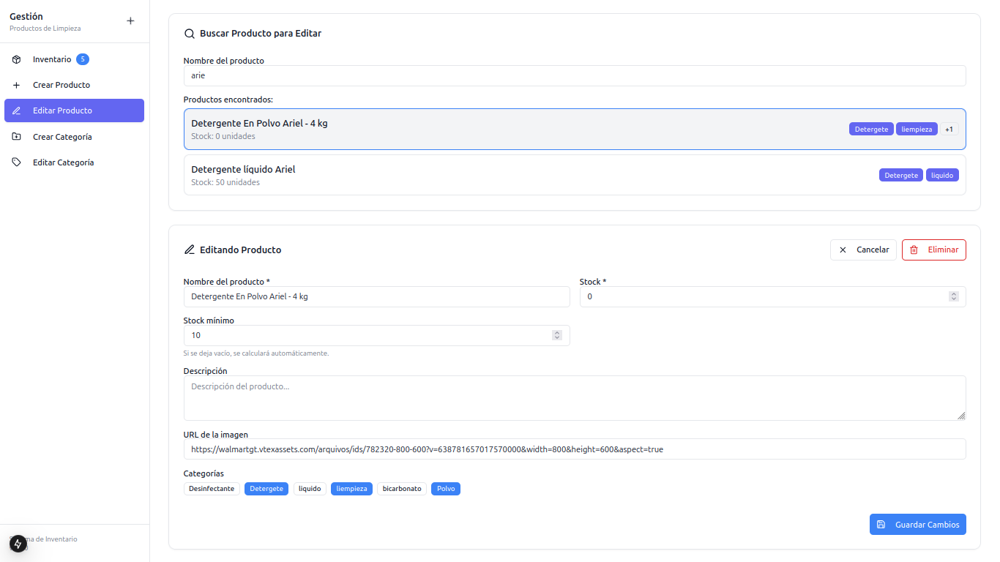

# Sistema de Inventario - Feria EMI

Este proyecto se presentara en la FERIA EMI 2025 en el contexto de utlización en las propias Universidad para ayudar y mantene un registro en el inventario de sus almacenes.
Siendo un sistema completo de gestión de inventario desarrollado con **NestJS** para el backend y **Next.js** para el frontend.

## Tecnologías Utilizadas

### Backend
- **NestJS** - Framework de Node.js
- **TypeORM** - ORM para base de datos
- **JWT** - Autenticación
- **Swagger** - Documentación de API

### Frontend
- **Next.js 15** - Framework de React
- **TypeScript** - Tipado estático
- **Tailwind CSS** - Framework de CSS
- **HeroUI** - Componentes de UI
- **Framer Motion** - Animaciones

## Características Principales

- **Autenticación segura** con OAuth y JWT
- **Gestión completa de productos** (crear, editar, eliminar, buscar)
- **Sistema de categorías** con colores personalizados (se pueden agregar, editar, eliminar)
- **Dashboard Inventario** con cantidades de productos y alerta si llega al mínimo o se agota
- **Búsqueda y filtrado avanzado** de productos
- **Interfaz responsive** adaptable a dispositivos móviles
- **Tema claro/oscuro** para mejor experiencia de usuario
- **Actualizaciones en tiempo real** del stock

## Página de Inventario en Ejecución:

### Página de Login


### Dashboard Principal


### Búsqueda de Productos


### Uso de Filtros de Productos por Categoría


### Creación de Producto


### Edición y Gestión de Productos


### Creación de Categorías


### Edición y Gestión de Categorías


### Gestión de Productos


### Modo Nocturno


### Vista Móvil de Login
<p align="center">
  
</p>

### Vista Móvil de Dashboard
<p align="center">
  
</p>

### Vista Móvil de Menú
<p align="center">
  
</p>

### Vista Móvil de Modo Noche
<p align="center">
  
</p>

### Vista Móvil de Editar Producto
<p align="center">
  
</p>

## Requisitos Previos

Antes de ejecutar el proyecto, asegúrate de tener instalado:

- **Node.js** (versión 18 o superior)
- **pnpm** (gestor de paquetes)
- **Base de datos** (PostgreSQL, MySQL, o SQLite)

### Instalación de pnpm

Si no tienes pnpm instalado, puedes instalarlo globalmente:

```bash
npm install -g pnpm
```

## Instrucciones de Instalación y Ejecución

### 1. Clonar el Repositorio

```bash
git clone <url-del-repositorio>
cd INVENTARIO_FERIA_EMI
```

### 2. Configuración del Backend

#### Navegar al directorio del backend
```bash
cd inventario-backend
```

#### Instalar dependencias
```bash
pnpm install
```

#### Configurar variables de entorno
Crea un archivo `.env` en la carpeta `inventario-backend` con las siguientes variables:

```env
# Base de datos
DATABASE_HOST=localhost
DATABASE_PORT=5432
DATABASE_USERNAME=tu_usuario
DATABASE_PASSWORD=tu_contraseña
DATABASE_NAME=inventario_db

# JWT
JWT_SECRET=tu_clave_secreta_jwt
JWT_EXPIRES_IN=7d

# Puerto de la aplicación
PORT=8080
```

#### Ejecutar el backend
```bash
# Modo desarrollo
pnpm start:dev

# Modo producción
pnpm build
pnpm start:prod
```

El backend estará disponible en: `http://localhost:8080`

### 3. Configuración del Frontend

#### Abrir una nueva terminal y navegar al directorio del frontend
```bash
cd inventario-frontend
```

#### Instalar dependencias
```bash
pnpm install
```

#### Configurar variables de entorno
Crea un archivo `.env.local` en la carpeta `inventario-frontend`:

```env
# URL del backend
NEXT_PUBLIC_API_BASE_URL=http://localhost:8080

# Autenticación OAuth
AUTH_SECRET="y4bOBBhrKQQjp/68jrmJHdkPYv5vGlyZe5AzyDiEeo8=" # Added by `npx auth`. Read more: https://cli.authjs.dev
```

> **Nota**: La clave `AUTH_SECRET` es necesaria para la autenticación OAuth. Puedes generar una nueva clave ejecutando `npx auth secret` o usar la proporcionada.

#### Ejecutar el frontend
```bash
# Modo desarrollo
pnpm dev

# Modo producción
pnpm build
pnpm start
```

El frontend estará disponible en: `http://localhost:3000`

## Scripts Disponibles

### Backend (inventario-backend)
- `pnpm start:dev` - Ejecuta en modo desarrollo con hot reload
- `pnpm start:prod` - Ejecuta en modo producción
- `pnpm build` - Construye el proyecto
- `pnpm test` - Ejecuta las pruebas
- `pnpm lint` - Ejecuta el linter

### Frontend (inventario-frontend)
- `pnpm dev` - Ejecuta en modo desarrollo
- `pnpm build` - Construye el proyecto para producción
- `pnpm start` - Ejecuta la versión de producción
- `pnpm lint` - Ejecuta el linter

## Uso del Sistema

1. **Acceso al Sistema**: Navega a `http://localhost:3000`
2. **Autenticación**: Inicia sesión con tus credenciales (por defecto en el proyecto estan como Usuario:Admin, Contraseña: Admin)
3. **Dashboard**: Gestiona productos, categorías e inventario
4. **API Documentation**: Visita `http://localhost:8080/api` para ver la documentación de Swagger

## Solución de Problemas

### El backend no se conecta a la base de datos
- Verifica que la base de datos esté ejecutándose
- Revisa las credenciales en el archivo `.env`
- Asegúrate de que la base de datos especificada existe

### Error de CORS en el frontend
- Verifica que la URL del backend en `.env.local` sea correcta
- Asegúrate de que el backend esté ejecutándose

### Problemas con pnpm
- Limpia el cache: `pnpm store prune`
- Elimina `node_modules` y reinstala: `rm -rf node_modules && pnpm install`

## Lincecias

MIT
